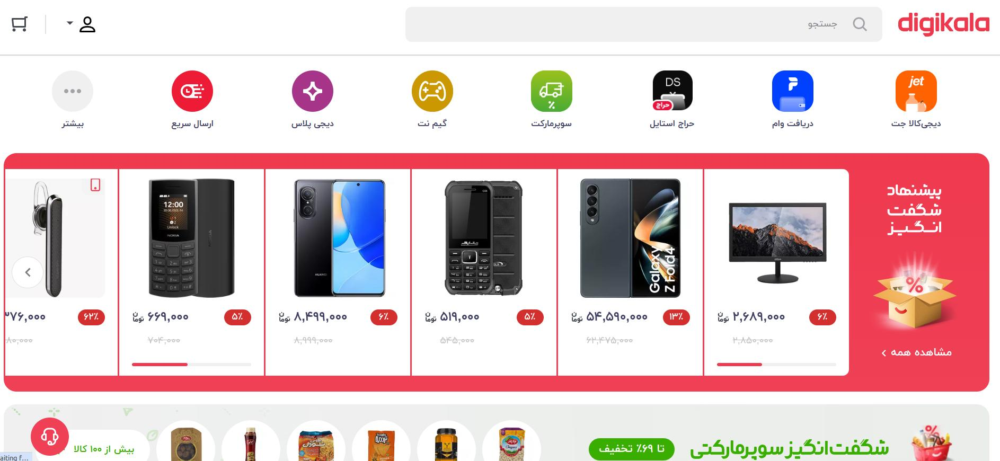

---
__آموزش برنامه نویسی سایت مشابه دیجیکالا :)__

- __[لینک دوره ی آموزش ساخت سایت مشابه دیجیکالا با لاراول](https://avasam.ir/product/34/digikala-course-with-laravel-and-kotlin/)__ - دوره ی آموزش فوق العاده به زبان فارسی با پشتیبانی آنلاین

میتونی باهاش پروژه هاتو جلو ببری!

---

# آموزش طراحی سایت مشابه دیجی کالا 

دیجی‌کالا، بزرگ‌ترین فروشگاه اینترنتی ایران، با ارائه خدمات گسترده و تجربه کاربری عالی، توانسته جایگاه خود را در میان کاربران ایرانی مستحکم کند. بسیاری از کسب‌وکارها به دنبال راه‌اندازی فروشگاه اینترنتی مشابه دیجی‌کالا هستند تا از مزایای آن بهره‌مند شوند. در این مقاله، به بررسی مراحل طراحی و ساخت فروشگاه اینترنتی مشابه دیجی‌کالا خواهیم پرداخت.

## آموزش ساخت اپلیکیشن مشابه اپ دیجیکالا با کاتلین 
کاتلین (Kotlin) یک زبان برنامه‌نویسی مدرن، شیءگرا و ایستا است که بر روی ماشین مجازی جاوا (JVM) اجرا می‌شود. این زبان توسط شرکت JetBrains توسعه یافته است و در سال 2011 منتشر شد.

کاتلین دارای مزایای زیادی نسبت به زبان جاوا است، از جمله:

ساختار کد ساده‌تر و خواناتر: کد کاتلین ساده‌تر و خواناتر از کد جاوا است. این امر به دلیل استفاده از ویژگی‌های مدرن زبان‌های برنامه‌نویسی مانند توابع lambda، ویژگی‌های کلاس‌ها و متدها، و سایر قابلیت‌ها است.

ایمن‌تر: کاتلین یک زبان ایمن‌تر از جاوا است. این امر به دلیل استفاده از ویژگی‌های ایمنی مانند نوع‌دهی ایستا، استفاده از متغیرها با مقدار پیش‌فرض، و سایر قابلیت‌ها است.

کارآمدتر: کاتلین یک زبان کارآمدتر از جاوا است. این امر به دلیل استفاده از ویژگی‌های عملکردی مانند توابع lambda، ویژگی‌های کلاس‌ها و متدها، و سایر قابلیت‌ها است.

[آموزش ساخت اپلیکیشن فروشگاهی مشابه دیجیکالا با کاتلین ](http://B2n.ir/DC_0122)
